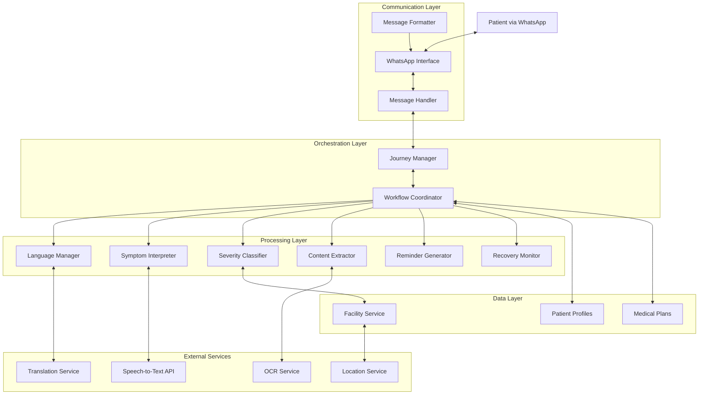
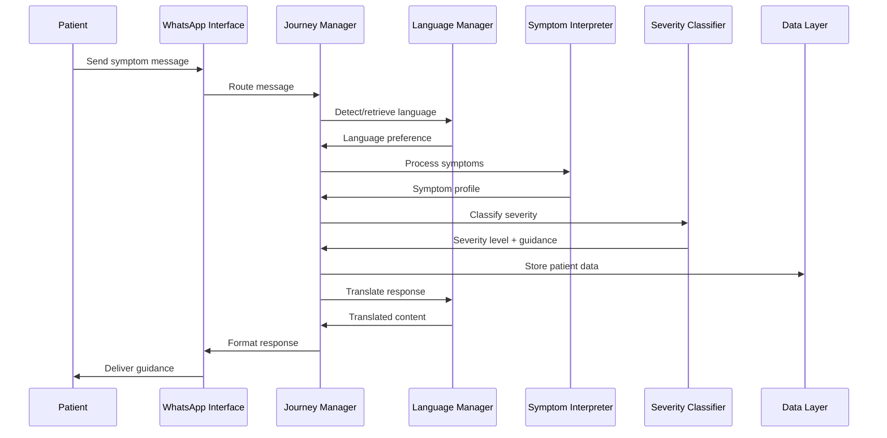

# Design Document: HealthMitra App

## Overview

HealthMitra is a WhatsApp-based multilingual healthcare assistant that provides end-to-end patient care guidance through a 6-step journey: language selection, symptom input, severity classification, care navigation, consultation recording, medication tracking, and recovery monitoring.

The system architecture follows a modular design with clear separation between:
- **Communication Layer**: WhatsApp integration and message handling
- **Processing Layer**: AI-powered symptom analysis, classification, and content extraction
- **Data Layer**: Patient profiles, medical plans, and preference storage
- **Orchestration Layer**: Journey management and workflow coordination

Key design principles:
- **Language-first**: All interactions respect patient's language preference
- **Safety-focused**: Medical safety rules and disclaimers throughout
- **Continuous care**: Seamless flow from symptom to recovery
- **Multi-modal**: Support for text, voice, and image inputs
- **Privacy-by-design**: Encryption and data protection at all levels

## Architecture

### High-Level Architecture



### Component Interaction Flow



## Components and Interfaces

### 1. WhatsApp Interface

**Responsibility**: Manage all communication with patients via WhatsApp Business API.

**Interface**:
```typescript
interface WhatsAppInterface {
  // Receive incoming messages
  receiveMessage(webhookPayload: WebhookPayload): Message
  
  // Send outgoing messages
  sendTextMessage(phoneNumber: string, text: string): Promise<MessageStatus>
  sendMediaMessage(phoneNumber: string, mediaUrl: string, caption: string): Promise<MessageStatus>
  
  // Download media
  downloadMedia(mediaId: string): Promise<Buffer>
  
  // Message status tracking
  getMessageStatus(messageId: string): Promise<DeliveryStatus>
}

interface Message {
  messageId: string
  from: string
  timestamp: Date
  type: 'text' | 'audio' | 'image' | 'video'
  content: string | Buffer
  metadata?: Record<string, any>
}
```

**Key Operations**:
- Webhook handling for incoming messages
- Message sending with retry logic
- Media download and validation
- Delivery status tracking

### 2. Message Handler

**Responsibility**: Parse, validate, and route incoming messages to appropriate processors.

**Interface**:
```typescript
interface MessageHandler {
  // Parse incoming message
  parseMessage(message: Message): ParsedMessage
  
  // Route to appropriate handler
  routeMessage(parsed: ParsedMessage, patientContext: PatientContext): HandlerRoute
  
  // Validate message content
  validateMessage(message: Message): ValidationResult
}

interface ParsedMessage {
  patientId: string
  messageType: MessageType
  content: any
  intent: Intent
  context: ConversationContext
}

enum Intent {
  INITIAL_CONTACT,
  SYMPTOM_DESCRIPTION,
  LANGUAGE_SELECTION,
  CONSULTATION_UPLOAD,
  RECOVERY_UPDATE,
  REMINDER_ACKNOWLEDGMENT,
  GENERAL_QUERY
}
```

### 3. Language Manager

**Responsibility**: Detect, store, and manage language preferences; translate all content.

**Interface**:
```typescript
interface LanguageManager {
  // Detect language from text
  detectLanguage(text: string): Promise<LanguageCode>
  
  // Store patient language preference
  setLanguagePreference(patientId: string, language: LanguageCode): Promise<void>
  
  // Retrieve language preference
  getLanguagePreference(patientId: string): Promise<LanguageCode>
  
  // Translate content
  translate(content: string, targetLanguage: LanguageCode): Promise<string>
  
  // Translate structured content
  translateStructured(content: StructuredContent, targetLanguage: LanguageCode): Promise<StructuredContent>
}

type LanguageCode = 'en' | 'hi' | 'bn' | 'te' | 'ta' | 'mr' | 'gu' | 'kn' | 'ml' | 'pa' // etc.

interface StructuredContent {
  sections: Array<{
    title: string
    content: string
    metadata?: Record<string, any>
  }>
}
```

### 4. Symptom Interpreter

**Responsibility**: Extract and normalize symptoms from patient input (text, voice, images).

**Interface**:
```typescript
interface SymptomInterpreter {
  // Process text symptoms
  interpretText(text: string, language: LanguageCode): Promise<SymptomProfile>
  
  // Process voice symptoms
  interpretVoice(audioBuffer: Buffer, language: LanguageCode): Promise<SymptomProfile>
  
  // Process visual symptoms
  interpretVisual(imageBuffer: Buffer): Promise<SymptomProfile>
  
  // Extract structured symptoms
  extractSymptoms(rawInput: string): SymptomExtraction
  
  // Normalize to medical terms
  normalizeSymptoms(extraction: SymptomExtraction): NormalizedSymptoms
}

interface SymptomProfile {
  mainSymptoms: string[]
  triggers: string[]
  context: SymptomContext
  riskIndicators: RiskIndicator[]
  confidence: number
  rawInput: string
}

interface SymptomContext {
  duration: string
  severity: string
  location?: string
  frequency?: string
  associatedFactors: string[]
}

interface RiskIndicator {
  type: 'red_flag' | 'warning' | 'info'
  description: string
  weight: number
}
```

### 5. Severity Classifier

**Responsibility**: Analyze symptoms and assign severity levels using medical safety rules.

**Interface**:
```typescript
interface SeverityClassifier {
  // Classify severity
  classifySeverity(symptomProfile: SymptomProfile): SeverityClassification
  
  // Reclassify based on recovery status
  reclassifySeverity(
    originalClassification: SeverityClassification,
    recoveryStatus: RecoveryStatus
  ): SeverityClassification
  
  // Apply medical safety rules
  applySafetyRules(symptoms: NormalizedSymptoms): SafetyAssessment
}

interface SeverityClassification {
  level: SeverityLevel
  reason: string
  recommendedAction: string
  disclaimer: string
  urgency: 'immediate' | 'within_24h' | 'within_week' | 'routine' | 'preventive'
}

enum SeverityLevel {
  S1_EMERGENCY = 'S1',
  S2_URGENT = 'S2',
  S3_MODERATE = 'S3',
  S4_MILD = 'S4',
  S5_WELLNESS = 'S5'
}

interface SafetyAssessment {
  emergencyFlags: string[]
  warningFlags: string[]
  safetyScore: number
  requiresImmediateCare: boolean
}
```

### 6. Care Navigator

**Responsibility**: Provide facility recommendations and care guidance based on severity.

**Interface**:
```typescript
interface CareNavigator {
  // Get care options for severity level
  getCareOptions(
    severity: SeverityLevel,
    location: Location
  ): Promise<CareOptions>
  
  // Find nearby facilities
  findNearbyFacilities(
    location: Location,
    facilityType: FacilityType,
    radius: number
  ): Promise<Facility[]>
  
  // Generate care guidance
  generateGuidance(severity: SeverityClassification): CareGuidance
}

interface CareOptions {
  facilities: Facility[]
  homeCarAdvice?: string[]
  precautions: string[]
  warningSigns: string[]
  whenToSeekCare: string
}

interface Facility {
  id: string
  name: string
  type: FacilityType
  address: string
  phone: string
  distance: number
  availability?: string
}

enum FacilityType {
  HOSPITAL = 'hospital',
  CLINIC = 'clinic',
  PHARMACY = 'pharmacy',
  DIAGNOSTIC_CENTER = 'diagnostic'
}

interface CareGuidance {
  immediateSteps: string[]
  whatToDo: string[]
  whatToAvoid: string[]
  monitoringAdvice: string[]
}
```

### 7. Content Extractor

**Responsibility**: Extract medical information from prescriptions and consultation recordings.

**Interface**:
```typescript
interface ContentExtractor {
  // Extract from prescription image
  extractPrescription(imageBuffer: Buffer): Promise<PrescriptionData>
  
  // Transcribe consultation audio
  transcribeConsultation(audioBuffer: Buffer, language: LanguageCode): Promise<ConsultationTranscript>
  
  // Parse medical content
  parseMedicalContent(text: string): MedicalInformation
  
  // Generate consultation summary
  generateSummary(
    prescription: PrescriptionData,
    transcript?: ConsultationTranscript
  ): ConsultationSummary
}

interface PrescriptionData {
  diagnosis?: string
  medications: Medication[]
  instructions: string[]
  doctorName?: string
  date?: Date
  confidence: number
}

interface Medication {
  name: string
  dosage: string
  frequency: string
  timing: string[]
  duration: string
  instructions?: string
}

interface ConsultationSummary {
  conditionOverview: string
  medicationSchedule: MedicationSchedule
  keyInstructions: string[]
  dietAdvice: string[]
  activityAdvice: string[]
  followUpDate?: Date
}
```

### 8. Medication Plan Manager

**Responsibility**: Create, store, and manage medication schedules.

**Interface**:
```typescript
interface MedicationPlanManager {
  // Create medication plan
  createPlan(
    patientId: string,
    medications: Medication[]
  ): Promise<MedicationPlan>
  
  // Get active plan
  getActivePlan(patientId: string): Promise<MedicationPlan | null>
  
  // Update plan
  updatePlan(planId: string, updates: Partial<MedicationPlan>): Promise<MedicationPlan>
  
  // Mark medication as taken
  recordAdherence(planId: string, medicationId: string, timestamp: Date): Promise<void>
  
  // Get adherence statistics
  getAdherenceStats(planId: string): Promise<AdherenceStats>
}

interface MedicationPlan {
  id: string
  patientId: string
  medications: ScheduledMedication[]
  startDate: Date
  endDate: Date
  status: 'active' | 'completed' | 'discontinued'
}

interface ScheduledMedication {
  id: string
  medication: Medication
  schedule: ReminderSchedule[]
  adherenceLog: AdherenceRecord[]
}

interface ReminderSchedule {
  time: string // HH:MM format
  daysOfWeek?: number[] // 0-6, if not daily
}

interface AdherenceRecord {
  scheduledTime: Date
  takenTime?: Date
  status: 'taken' | 'missed' | 'pending'
}
```

### 9. Reminder Generator

**Responsibility**: Generate and send medication reminders at scheduled times.

**Interface**:
```typescript
interface ReminderGenerator {
  // Schedule reminders for a plan
  scheduleReminders(plan: MedicationPlan): Promise<void>
  
  // Generate reminder message
  generateReminderMessage(
    medication: ScheduledMedication,
    language: LanguageCode
  ): ReminderMessage
  
  // Send reminder
  sendReminder(patientId: string, reminder: ReminderMessage): Promise<void>
  
  // Handle missed reminder
  handleMissedReminder(patientId: string, medicationId: string): Promise<void>
  
  // Cancel reminders
  cancelReminders(planId: string): Promise<void>
}

interface ReminderMessage {
  medicationName: string
  dosage: string
  instructions: string
  time: string
  specialNotes?: string
}
```

### 10. Recovery Monitor

**Responsibility**: Track patient recovery and trigger reclassification when needed.

**Interface**:
```typescript
interface RecoveryMonitor {
  // Schedule check-in
  scheduleCheckIn(patientId: string, interval: number): Promise<void>
  
  // Send check-in message
  sendCheckIn(patientId: string, language: LanguageCode): Promise<void>
  
  // Process check-in response
  processCheckInResponse(
    patientId: string,
    response: Message
  ): Promise<RecoveryStatus>
  
  // Analyze recovery trend
  analyzeRecoveryTrend(patientId: string): Promise<RecoveryTrend>
  
  // Determine if reclassification needed
  needsReclassification(recoveryStatus: RecoveryStatus): boolean
}

interface RecoveryStatus {
  status: 'improving' | 'unchanged' | 'worsening'
  symptoms: SymptomProfile
  comparisonToBaseline: ComparisonResult
  confidence: number
  timestamp: Date
}

interface RecoveryTrend {
  dataPoints: RecoveryStatus[]
  overallTrend: 'positive' | 'stable' | 'negative'
  concerningPatterns: string[]
}

interface ComparisonResult {
  symptomChange: 'better' | 'same' | 'worse'
  newSymptoms: string[]
  resolvedSymptoms: string[]
  persistingSymptoms: string[]
}
```

### 11. Journey Manager

**Responsibility**: Orchestrate the 6-step patient journey and maintain state.

**Interface**:
```typescript
interface JourneyManager {
  // Initialize new patient journey
  startJourney(patientId: string): Promise<Journey>
  
  // Get current journey state
  getJourneyState(patientId: string): Promise<JourneyState>
  
  // Advance to next step
  advanceStep(patientId: string, stepData: any): Promise<JourneyState>
  
  // Handle step completion
  completeStep(patientId: string, step: JourneyStep): Promise<void>
  
  // Reset journey (for reclassification)
  resetToStep(patientId: string, step: JourneyStep): Promise<void>
}

interface Journey {
  id: string
  patientId: string
  currentStep: JourneyStep
  stepHistory: StepRecord[]
  startedAt: Date
  lastActivity: Date
}

enum JourneyStep {
  LANGUAGE_SELECTION = 1,
  SYMPTOM_INPUT = 2,
  SEVERITY_CLASSIFICATION = 3,
  CARE_NAVIGATION = 4,
  CONSULTATION_RECORDING = 5,
  MEDICATION_TRACKING = 6,
  RECOVERY_MONITORING = 7
}

interface StepRecord {
  step: JourneyStep
  completedAt: Date
  data: any
}
```

### 12. Patient Profile Repository

**Responsibility**: Store and retrieve patient data securely.

**Interface**:
```typescript
interface PatientProfileRepository {
  // Create patient profile
  createProfile(phoneNumber: string): Promise<PatientProfile>
  
  // Get profile
  getProfile(patientId: string): Promise<PatientProfile | null>
  
  // Update profile
  updateProfile(patientId: string, updates: Partial<PatientProfile>): Promise<PatientProfile>
  
  // Store symptom history
  addSymptomRecord(patientId: string, symptomProfile: SymptomProfile): Promise<void>
  
  // Store classification history
  addClassificationRecord(patientId: string, classification: SeverityClassification): Promise<void>
  
  // Delete patient data
  deleteProfile(patientId: string): Promise<void>
}

interface PatientProfile {
  id: string
  phoneNumber: string
  languagePreference: LanguageCode
  location?: Location
  symptomHistory: SymptomProfile[]
  classificationHistory: SeverityClassification[]
  consultationSummaries: ConsultationSummary[]
  activeMedicationPlan?: string // plan ID
  createdAt: Date
  updatedAt: Date
}

interface Location {
  latitude: number
  longitude: number
  address?: string
}
```

## Data Models

### Core Data Structures

```typescript
// Patient Context
interface PatientContext {
  profile: PatientProfile
  journey: Journey
  currentConversation: ConversationContext
}

interface ConversationContext {
  messageHistory: Message[]
  lastIntent: Intent
  awaitingResponse: boolean
  expectedResponseType?: string
}

// Medical Data
interface NormalizedSymptoms {
  symptoms: Array<{
    term: string
    medicalCode?: string
    severity: 'mild' | 'moderate' | 'severe'
    bodyPart?: string
  }>
  systemsAffected: string[]
  redFlags: string[]
}

interface MedicationSchedule {
  medications: Array<{
    name: string
    times: string[]
    withFood: boolean
    specialInstructions: string
  }>
  dailySchedule: Map<string, string[]> // time -> medication names
}

// System Data
interface AdherenceStats {
  totalDoses: number
  takenDoses: number
  missedDoses: number
  adherenceRate: number
  streakDays: number
  lastMissedDate?: Date
}

interface MessageStatus {
  messageId: string
  status: 'sent' | 'delivered' | 'read' | 'failed'
  timestamp: Date
  error?: string
}
```

### Data Storage Schema

```typescript
// Database Collections/Tables

// patients
interface PatientRecord {
  id: string
  phone_number: string
  language_preference: string
  location_lat?: number
  location_lng?: number
  location_address?: string
  created_at: Date
  updated_at: Date
  encrypted_data: string // Contains sensitive health data
}

// symptom_records
interface SymptomRecord {
  id: string
  patient_id: string
  symptoms: object // JSON
  classification: object // JSON
  created_at: Date
}

// medication_plans
interface MedicationPlanRecord {
  id: string
  patient_id: string
  medications: object // JSON
  start_date: Date
  end_date: Date
  status: string
  created_at: Date
}

// adherence_logs
interface AdherenceLog {
  id: string
  plan_id: string
  medication_id: string
  scheduled_time: Date
  taken_time?: Date
  status: string
  created_at: Date
}

// recovery_checks
interface RecoveryCheckRecord {
  id: string
  patient_id: string
  status: string
  symptoms: object // JSON
  comparison: object // JSON
  created_at: Date
}

// journeys
interface JourneyRecord {
  id: string
  patient_id: string
  current_step: number
  step_history: object // JSON
  started_at: Date
  last_activity: Date
}
```

## Correctness Properties


*A property is a characteristic or behavior that should hold true across all valid executions of a system—essentially, a formal statement about what the system should do. Properties serve as the bridge between human-readable specifications and machine-verifiable correctness guarantees.*

### Language Management Properties

**Property 1: Language Preference Persistence**
*For any* language selection by a patient, storing the preference and then retrieving it should return the same language code.
**Validates: Requirements 1.2**

**Property 2: Language Detection Accuracy**
*For any* text input in a supported language, the language detection system should correctly identify the language code.
**Validates: Requirements 1.3**

**Property 3: Universal Language Preference Application**
*For any* system-generated output (classification, guidance, reminder, summary, check-in) to a patient with a stored language preference, the content should be delivered in that patient's preferred language.
**Validates: Requirements 1.4, 3.3, 4.7, 5.6, 7.4, 8.2, 8.8, 9.6**

**Property 4: Language Preference Update**
*For any* language change request, the stored preference should be updated and all subsequent responses should use the new language.
**Validates: Requirements 1.5**

### Symptom Processing Properties

**Property 5: Text Symptom Extraction Completeness**
*For any* text symptom description, the extraction should produce a symptom profile containing main symptoms, triggers, context, and risk indicators.
**Validates: Requirements 2.1, 2.5**

**Property 6: Voice Symptom Processing Pipeline**
*For any* voice message input, the system should transcribe it to text and then extract a symptom profile.
**Validates: Requirements 2.2**

**Property 7: Visual Input Processing**
*For any* image or video input, the system should process it and extract health-related information.
**Validates: Requirements 2.3**

**Property 8: Symptom Normalization**
*For any* symptom input, the output should contain normalized medical terms in addition to the raw input.
**Validates: Requirements 2.4**

**Property 9: Low Confidence Clarification**
*For any* symptom extraction with confidence below a threshold, the system should generate clarifying questions in the patient's language preference.
**Validates: Requirements 2.6, 12.5**

### Severity Classification Properties

**Property 10: Classification Triggering**
*For any* completed symptom profile, the severity classifier should be invoked and produce a classification result.
**Validates: Requirements 3.1**

**Property 11: Valid Severity Level Assignment**
*For any* severity classification result, the assigned severity level should be one of the five valid values: S1, S2, S3, S4, or S5.
**Validates: Requirements 3.2**

**Property 12: Classification Completeness**
*For any* severity classification, the output should include a severity level, reason, recommended action, and safety disclaimer.
**Validates: Requirements 3.3, 3.4, 3.5**

**Property 13: Consistent Reclassification Rules**
*For any* severity reclassification during recovery monitoring, the same medical safety rules should be applied as in initial classification.
**Validates: Requirements 9.2**

### Care Navigation Properties

**Property 14: Emergency Care Facility Recommendations**
*For any* severity classification of S1 or S2, the care navigation output should include a list of nearby hospitals with contact information.
**Validates: Requirements 4.1**

**Property 15: Moderate Care Facility Recommendations**
*For any* severity classification of S3, the care navigation output should include a list of nearby clinics.
**Validates: Requirements 4.2**

**Property 16: Pharmacy Recommendations for Medication**
*For any* severity classification that includes medication recommendations, the care navigation output should include nearby pharmacy locations.
**Validates: Requirements 4.3**

**Property 17: Location-Based Facility Sorting**
*For any* facility search with a patient location, the results should be sorted by distance from the patient's location.
**Validates: Requirements 4.4**

**Property 18: Home Care Guidance for Mild Cases**
*For any* severity classification of S4 or S5, the care navigation output should include home care advice and precautionary steps.
**Validates: Requirements 4.5**

**Property 19: Care Navigation Completeness**
*For any* care navigation output, it should include instructions on what to do, what to avoid, and when to seek professional care.
**Validates: Requirements 4.6**

### Consultation Recording Properties

**Property 20: Prescription OCR Processing**
*For any* prescription image upload, OCR should be performed and text should be extracted.
**Validates: Requirements 5.1**

**Property 21: Consultation Audio Transcription**
*For any* consultation audio upload, the audio should be transcribed to text.
**Validates: Requirements 5.2**

**Property 22: Medical Information Extraction**
*For any* prescription or consultation data, the extraction should identify diagnosis, medicine names, dosage, timing, duration, and doctor's advice where present.
**Validates: Requirements 5.3**

**Property 23: Consultation Summary Generation**
*For any* completed extraction, a consultation summary should be generated with structured sections.
**Validates: Requirements 5.4**

**Property 24: Consultation Summary Completeness**
*For any* consultation summary, it should include condition overview, medication schedule, key instructions, and diet or activity advice sections.
**Validates: Requirements 5.5**

**Property 25: Low Quality Extraction Clarification**
*For any* OCR or transcription result with confidence below a threshold, the system should generate a clarification request to the patient.
**Validates: Requirements 5.7**

### Medication Plan Properties

**Property 26: Medication Plan Creation**
*For any* processed prescription with medication information, a structured medication plan should be created.
**Validates: Requirements 6.1**

**Property 27: Medication Plan Data Completeness**
*For any* medication plan, it should store medicine names, dosage amounts, timing schedules, and treatment duration for each medication.
**Validates: Requirements 6.2**

**Property 28: Multi-Medication Organization**
*For any* medication plan with multiple medicines, the medications should be organized by timing to group concurrent doses.
**Validates: Requirements 6.3**

**Property 29: Medication Plan Validation**
*For any* medication plan creation attempt, validation should ensure all required fields (medicine, dosage, timing, duration) are present before storing.
**Validates: Requirements 6.4**

**Property 30: Incomplete Prescription Handling**
*For any* prescription with missing required information, the system should generate a request for the missing details.
**Validates: Requirements 6.5**

**Property 31: Medication Plan Persistence**
*For any* stored medication plan, retrieving it by plan ID should return the same plan data.
**Validates: Requirements 6.6**

### Medication Reminder Properties

**Property 32: Reminder Generation from Plan**
*For any* medication plan, reminders should be generated for all scheduled medication times.
**Validates: Requirements 7.1**

**Property 33: Reminder Delivery at Scheduled Time**
*For any* scheduled reminder time that arrives, a reminder message should be sent to the patient.
**Validates: Requirements 7.2**

**Property 34: Reminder Content Completeness**
*For any* medication reminder, it should include the medicine name, dosage, and any special instructions.
**Validates: Requirements 7.3**

**Property 35: Missed Reminder Follow-up**
*For any* reminder that is not acknowledged within a timeout period, a follow-up prompt should be sent.
**Validates: Requirements 7.5**

**Property 36: Reminder Expiration**
*For any* medication past its end date, no new reminders should be generated.
**Validates: Requirements 7.6**

**Property 37: Plan Completion Notification**
*For any* medication plan where all medications have reached their end dates, a completion notification and recovery check-in suggestion should be sent.
**Validates: Requirements 7.7**

### Recovery Monitoring Properties

**Property 38: Periodic Check-in Scheduling**
*For any* active treatment plan, recovery check-in messages should be scheduled and sent at defined intervals.
**Validates: Requirements 8.1**

**Property 39: Multi-modal Check-in Response Handling**
*For any* check-in response (text, voice, or image), the system should process it and extract recovery information.
**Validates: Requirements 8.3**

**Property 40: Recovery Status Determination**
*For any* check-in response analysis, the system should determine a recovery status of improving, unchanged, or worsening.
**Validates: Requirements 8.4, 8.5**

**Property 41: Worsening Condition Reclassification**
*For any* recovery status indicating worsening condition, severity reclassification should be triggered.
**Validates: Requirements 8.6, 9.1, 13.6**

**Property 42: Reclassification Care Updates**
*For any* completed reclassification, updated care recommendations should be provided based on the new severity level.
**Validates: Requirements 8.7**

**Property 43: Severity Level Comparison**
*For any* reclassification, the new severity level should be compared to the previous level.
**Validates: Requirements 9.3**

**Property 44: Escalated Care for Severity Increase**
*For any* reclassification where the new severity level is higher than the previous level, escalated care options should be recommended.
**Validates: Requirements 9.4**

**Property 45: Continued Recovery Guidance for Severity Decrease**
*For any* reclassification where the new severity level is lower than the previous level, continued recovery guidance should be provided.
**Validates: Requirements 9.5**

### WhatsApp Integration Properties

**Property 46: WhatsApp Message Formatting**
*For any* message sent via WhatsApp, it should be formatted appropriately for WhatsApp display constraints.
**Validates: Requirements 10.4**

**Property 47: Multimedia Content Processing**
*For any* multimedia message (voice, image, video), the content should be downloaded and processed.
**Validates: Requirements 10.5**

**Property 48: Structured Information Formatting**
*For any* structured content (lists, schedules, summaries), it should be formatted clearly using WhatsApp formatting capabilities.
**Validates: Requirements 10.6**

**Property 49: Failed Delivery Retry**
*For any* message delivery failure, the message should be queued for retry.
**Validates: Requirements 10.7**

### Data Security Properties

**Property 50: Health Data Encryption at Rest**
*For any* patient health information stored in the database, it should be encrypted.
**Validates: Requirements 11.1**

**Property 51: Patient Data Association**
*For any* stored medical data (symptom profile, consultation summary, medication plan), it should be associated with the correct patient ID.
**Validates: Requirements 11.5**

**Property 52: Complete Data Deletion**
*For any* patient data deletion request, all personal health information for that patient should be removed from storage.
**Validates: Requirements 11.6**

### Input Processing Properties

**Property 53: Informal Text Handling**
*For any* text input containing informal language, typos, or colloquialisms, the system should still extract symptom information.
**Validates: Requirements 12.3**

**Property 54: Context Preservation in Extraction**
*For any* input processing, the extracted medical information should preserve the context from the original input.
**Validates: Requirements 12.4**

**Property 55: Processing Error Messages**
*For any* input processing failure, a helpful error message should be generated in the patient's language preference.
**Validates: Requirements 12.7**

### Workflow Continuity Properties

**Property 56: Symptom to Classification Progression**
*For any* completed symptom input, severity classification should be automatically triggered.
**Validates: Requirements 13.1**

**Property 57: Classification to Navigation Progression**
*For any* completed severity classification, care navigation should be automatically triggered.
**Validates: Requirements 13.2**

**Property 58: Consultation to Summary Progression**
*For any* consultation information upload, consultation summary and medication plan generation should be automatically triggered.
**Validates: Requirements 13.3**

**Property 59: Plan to Reminders Progression**
*For any* created medication plan, reminder scheduling should be automatically triggered.
**Validates: Requirements 13.4**

**Property 60: Reminders to Monitoring Progression**
*For any* active medication reminder schedule, recovery monitoring check-ins should be automatically scheduled.
**Validates: Requirements 13.5**

**Property 61: Journey State Persistence**
*For any* patient journey, the journey state should be maintained across all steps without requiring restart.
**Validates: Requirements 13.7**

## Error Handling

### Error Categories

1. **Input Processing Errors**
   - Invalid or corrupted media files
   - Unsupported file formats
   - Speech-to-text failures
   - OCR failures
   - Language detection failures

2. **External Service Errors**
   - WhatsApp API failures
   - Translation service timeouts
   - Location service unavailability
   - OCR service errors

3. **Data Validation Errors**
   - Incomplete prescription information
   - Missing required patient data
   - Invalid medication schedules
   - Malformed symptom profiles

4. **Business Logic Errors**
   - Unable to classify severity
   - No facilities found in location
   - Conflicting medication timings
   - Invalid journey state transitions

### Error Handling Strategies

**Graceful Degradation**:
- If translation fails, deliver content in English with a note
- If OCR confidence is low, request manual input
- If location unavailable, provide general facility recommendations
- If severity classification uncertain, default to higher severity for safety

**Retry Logic**:
- WhatsApp message delivery: 3 retries with exponential backoff
- External API calls: 2 retries with 1-second delay
- Database operations: 2 retries for transient failures

**User Communication**:
- All errors communicated in patient's language preference
- Clear instructions on how to resolve the issue
- Alternative input methods suggested when primary fails
- Support contact information for unresolvable errors

**Logging and Monitoring**:
- All errors logged with context (patient ID, journey step, input type)
- Critical errors (S1 classification failures) trigger alerts
- Error rates monitored per component
- Failed message queue monitored for delivery issues

### Safety-Critical Error Handling

For errors during emergency (S1) or urgent (S2) severity classification:
- Default to S1 if classification fails
- Immediately provide emergency contact numbers
- Log critical error for manual review
- Send alert to system administrators

## Testing Strategy

### Dual Testing Approach

The HealthMitra system requires both unit testing and property-based testing to ensure comprehensive correctness:

**Unit Tests** focus on:
- Specific examples of symptom classification (e.g., "chest pain + shortness of breath" → S1)
- Edge cases like empty inputs, malformed data, boundary conditions
- Integration points between components
- Error conditions and exception handling
- Specific language translations for critical messages

**Property-Based Tests** focus on:
- Universal properties that hold across all inputs (see Correctness Properties section)
- Comprehensive input coverage through randomization
- Invariants that must be maintained (e.g., language preference always respected)
- Round-trip properties (e.g., store then retrieve medication plan)
- Workflow continuity across journey steps

### Property-Based Testing Configuration

**Framework Selection**:
- **TypeScript/JavaScript**: fast-check
- **Python**: Hypothesis
- **Java**: jqwik

**Test Configuration**:
- Minimum 100 iterations per property test
- Each test tagged with: `Feature: healthmitra-app, Property {number}: {property_text}`
- Seed-based reproducibility for failed tests
- Shrinking enabled to find minimal failing examples

**Example Property Test Structure**:
```typescript
// Example for Property 1: Language Preference Persistence
test('Property 1: Language Preference Persistence', async () => {
  await fc.assert(
    fc.asyncProperty(
      fc.string(), // patientId
      fc.constantFrom('en', 'hi', 'bn', 'te', 'ta', 'mr'), // languageCode
      async (patientId, languageCode) => {
        // Store language preference
        await languageManager.setLanguagePreference(patientId, languageCode);
        
        // Retrieve language preference
        const retrieved = await languageManager.getLanguagePreference(patientId);
        
        // Assert they match
        expect(retrieved).toBe(languageCode);
      }
    ),
    { numRuns: 100 }
  );
});
```

### Test Data Generation

**Generators for Property Tests**:
- Random symptom descriptions in multiple languages
- Random patient profiles with various language preferences
- Random medication schedules with varying complexities
- Random severity levels and recovery statuses
- Random locations for facility recommendations
- Random prescription images with varying quality
- Random audio files with different accents and clarity

**Edge Case Generators**:
- Empty inputs
- Very long inputs (stress testing)
- Special characters and emojis
- Mixed-language inputs
- Corrupted media files
- Extreme dates (past/future)

### Integration Testing

**Journey Flow Tests**:
- Complete 6-step journey from symptom to recovery
- Journey interruption and resumption
- Multiple concurrent journeys for different patients
- Journey state persistence across system restarts

**External Service Integration**:
- WhatsApp API integration with mock responses
- Translation service with fallback scenarios
- OCR service with various image qualities
- Location service with different geographic regions

### Performance Testing

**Load Testing**:
- Concurrent patient interactions (target: 1000 concurrent users)
- Message processing throughput (target: 100 messages/second)
- Reminder delivery at scale (target: 10,000 reminders/hour)

**Latency Testing**:
- Symptom classification response time (target: < 2 seconds)
- Message delivery time (target: < 1 second)
- OCR processing time (target: < 5 seconds)

### Security Testing

**Data Protection**:
- Encryption verification for stored data
- Secure transmission verification
- Access control testing
- Data deletion completeness verification

**Input Validation**:
- SQL injection prevention
- XSS prevention in message formatting
- File upload validation (size, type, content)
- Rate limiting for API endpoints

### Monitoring and Observability

**Key Metrics**:
- Journey completion rates per step
- Classification accuracy (validated against medical review)
- Medication adherence rates
- Recovery improvement rates
- Error rates per component
- Message delivery success rates
- Average response times

**Alerting**:
- Critical errors in S1/S2 classification
- WhatsApp API failures
- Database connection failures
- Unusual error rate spikes
- Failed message queue buildup

## Implementation Notes

### Technology Stack Recommendations

**Backend**:
- Node.js with TypeScript for type safety
- Express.js for API endpoints
- PostgreSQL for relational data with encryption
- Redis for caching and message queuing
- Bull for job scheduling (reminders, check-ins)

**External Services**:
- WhatsApp Business API for messaging
- Google Cloud Speech-to-Text for voice processing
- Google Cloud Vision API for OCR
- Google Cloud Translation API for multilingual support
- Google Maps API for location services

**Infrastructure**:
- Docker containers for deployment
- Kubernetes for orchestration
- AWS/GCP for cloud hosting
- CloudWatch/Stackdriver for monitoring
- Sentry for error tracking

### Scalability Considerations

**Horizontal Scaling**:
- Stateless API servers for easy scaling
- Message queue for asynchronous processing
- Database read replicas for query load
- CDN for static content delivery

**Data Partitioning**:
- Patient data partitioned by region
- Time-series data (adherence logs) partitioned by date
- Separate databases for operational and analytical workloads

**Caching Strategy**:
- Patient profiles cached for active sessions
- Facility data cached by location
- Translation results cached by language pair
- Medication plan cached during active treatment

### Deployment Strategy

**Phased Rollout**:
1. Alpha: Internal testing with simulated patients
2. Beta: Limited release to 100 real patients
3. Pilot: Regional release to 1,000 patients
4. General Availability: Full release with monitoring

**Feature Flags**:
- Enable/disable specific journey steps
- Toggle between translation services
- Control reminder frequency
- Enable/disable recovery monitoring

**Rollback Plan**:
- Database migration rollback scripts
- Previous version containers ready for quick redeployment
- Feature flags to disable problematic features
- Data backup before each deployment
